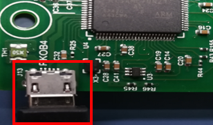
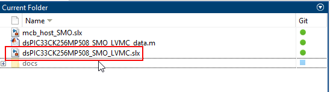
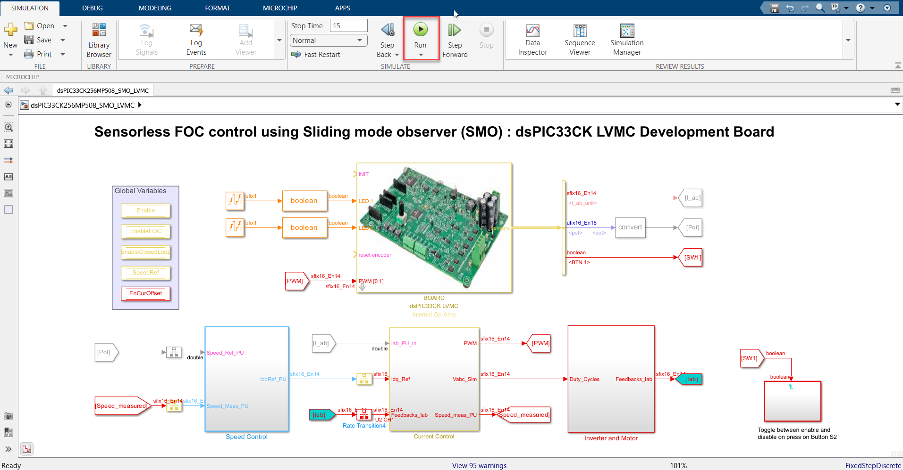
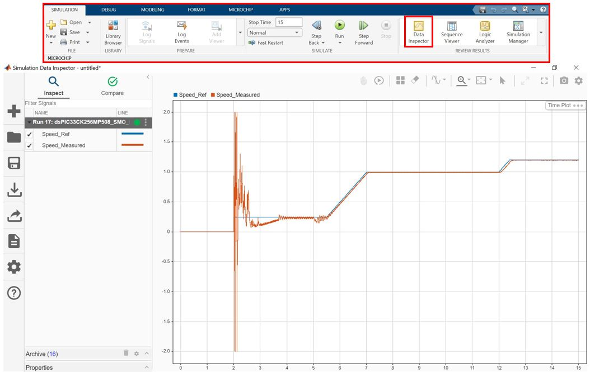

 

# MATLAB LVMC dsPIC33CK256MP508 FOC with Field Weakening & SMO

## 1. INTRODUCTION

This document describes the setup requirements for running the Sensorless FOC with field weakening algorithm and a Sliding Mode Observer (SMO), using MATLAB/Simulink and dsPIC33CK Low Voltage Motor Control (LVMC) Board.

The SMO implementation is referenced from AN1078 “Sensorless Field Oriented Control of a PMSM”.

## 2.	SUGGESTED DEMONSTRATION REQUIREMENTS
### 2.1 MATLAB Model Required for the Demonstration
-  MATLAB model can be cloned or downloaded as zip file from the Github repository ([link](https://github.com/microchip-pic-avr-solutions/matlab-lvmc-dspic33ck256mp508-foc-smo)).

### 2.2	Software Tools Used for Testing the MATLAB/Simulink Model
1.	MPLAB X IDE and IPE (v6.15)
2.	XC16 compiler (v2.10)
3.	MATLAB R2023b
4.	Required MATLAB add-on packages
    -	Simulink (v23.2)
    -	Simulink Coder (v23.2)
    -	Stateflow (v23.2)
    -	MATLAB Coder (v23.2)
    -	Embedded Coder (v23.2)
    -	MPLAB Device blocks for Simulink (v3.51)
    - Motor Control Blockset (v23.2)

> **_NOTE:_**
>The software used for testing the model during release is listed above. It is recommended to use the version listed above or later versions for building the model.

### 2.3	Hardware Tools Required for the Demonstration
- dsPIC33CK Low Voltage Motor Control (LVMC) Development Board ([DM330031](https://www.microchip.com/en-us/development-tool/DM330031))
- 24V Power Supply ([AC002013](https://www.microchipdirect.com/dev-tools/AC002013)) 
- 24V, 3-Phase Brushless DC Permanent Magnet Hurst Motor ([AC300022](https://www.microchip.com/en-us/development-tool/AC300022))

> **_NOTE:_**
>All items listed under this section Hardware Tools Required for the Demonstration are available at [microchip DIRECT](https://www.microchipdirect.com/).

  
## 3. HARDWARE SETUP

This section describes hardware setup required for the demonstration.

1. 
 Connect the 3-phase wires from the motor to PHC, PHB, and PHA of the J14 connector (no specific order), provided on the dsPIC33CK LVMC Board.

    

    

2. 
 Plug in the 24V power supply to connector J1 provided on the dsPIC33CK LVMC Board. Al-ternatively, the Inverter Board can also be powered through Connector J2.

    

    

3. 
 The board has an onboard programmer ‘PICkit™ On Board (PKoBv4)”, which can be used for programming or debugging the dsPIC33CK256MP508. To use an on-board programmer, connect a micro-USB cable between Host PC and Micro USB connector J13 provided on the dsPIC33CK LVMC Board.

    

    

4. 
	Alternatively, the device can also be programmed using the programmer/debugger (MPLAB® PICkit™ 4 In-Circuit Debugger - PG164140) by interfacing it through connector J10 of the dsPIC33CK LVMC Board, as shown below. Ensure that the programmer is oriented correctly before proceeding.

    

    

## 4.	BASIC DEMONSTRATION

 Follow the below instructions step-by-step, to set up and run the motor control demo application:

1. Launch MATLAB (refer the section [“2.2 Sofware Tools Used for Testing the MATLAB/Simulink Model"](#22-software-tools-used-for-testing-the-matlabsimulink-model)).
 
2. Open the folder dowmloaded from the repository, in which MATLAB files are saved (refer the section ["2.1 MATLAB Model Required for the Demonstration"](#21-matlab-model-required-for-the-demonstration)).

    

    

3.	
 Double click and open the .m file. This .m file contains the configuration parameter for the motor and board. By default, the .m file is configured to run Hurst 300 motor and LVMC board. Run the file by clicking the <b>“Run”</b> icon and wait till all variables gets loaded on the <b>‘Workspace’</b> tab.

    

      

    

4.	
Double click on the Sensorless FOC Simulink model.

    

      

    

5.	
This opens the Simulink model as shown below. Click on the <b>"Run"</b> icon to start the simulation.

    

      

    

6.	
To plot the simulation result, <b>Data Inspector</b> is used (refer to figure below). To observe the additional signals, log them as required. Alternatively, normal Simulink Scope can be used to plot the signals.

    

      

    

7.	
From this Simulink model an MPLAB X project can be generated, and it can be used to run the PMSM motor using LVMC board. 
To generate the code from the Simulink model, go to the <b>"MICROCHIP"</b> tab, and enable the tabs shown in the figure below. 

    

      

    

8.	
	To generate the code and run the motor, click on <b>‘Build Model’ or ‘Clean Build Model’</b> option under the <b>“Microchip”</b> tab. This will generate the MPLAB X project from the Simulink model and program the dsPIC33CK256MP508 device.

    

      

    

9.	
After completing the process, the <b>‘Operation Succeeded’</b> message will be displayed on the <b>‘Diagnostics Viewer’</b>.

    

      

    

10.	If the device is successfully programmed, <b>LED- LD10 and LD11</b> will be blinking.

11.	To Run the motor, press the push button <b>SW1</b>.

    

      
 
    

12.	The motor speed can be varied using the potentiometer (labeled <b>“POT1”</b>). Approximately, after 70% of the full potentiometer value (approximately at 3000 RPM), the motor eneters into field weakening region.

    

      

    

13.	Press the push button <b>SW1</b> to stop the motor.

    

      

    

## 5.	DATA VISUALIZATION USING MOTOR CONTROL BLOCKSET (MCB) HOST MODEL

The Sensorless FOC model comes with the initialization required for data visualization using Motor Control Blockset Host Model (MCB Host Model). The MCB Host Model is a Simulink model which facilitates data visualization through the UART Serial Interface. 

1.	
To establish serial communication with the host PC, connect a micro-USB cable between the host PC and the dsPIC33CK LVMC Board (J13 connector). This interface is used for programming as well. (Alternatively, a micro-USB cable can be connected from the host PC to the J6 connector of the dsPIC33CK LVMC Board to establish the serial communication).
    

      

    

2. Ensure the sensorless FOC model is programmed and running as described under section ["4. Basic Demonstration"](#4-basic-demonstration) by following steps 1 through 13.

3. 
Open the MCB Host model and double click on the <b>“Serial Setup”</b> block. Then select the appropriate COM port connected to the hardware from the drop-down menu and set the baud rate as 460829. Please note that the same baud rate is required to be chosen in the Sensorless FOC model (the baud rate can be viewed on the <b>“UART Configuration”</b> block inside <b>“LVMC Template”</b>).

    

      

    

4.	
Open the <b>“UART_Rx”</b> subsystem to configure the COM port. This can be done by configuring the <b>“Host Serial Receive”</b> block of the “UART_Rx” subsystem. Ensure to select the same COM port configured in step 3. 

    

      

    

5.	
Click the run icon of the MCB Host model to open the scope window and monitor the signals.

    

      

    

6.	
In the figure below, one example is shown where two signals (estimated and reference speeds) have been plotted.

    

      

    

## 	REFERENCES:
For more information, refer to the following documents or links.
1.	AN1078 Application Note “[Sensorless Field Oriented Control of a PMSM](https://www.microchip.com/en-us/application-notes/an1078)”.
2.	dsPIC33CK LVMC Board User’s Guide ([DS50003297](http://ww1.microchip.com/downloads/en/DeviceDoc/DS50002927a.pdf)) 
3.	[MPLAB® X IDE installation](https://microchipdeveloper.com/mplabx:installation)
4.	[MPLAB® XC16 Compiler installation](https://microchipdeveloper.com/mplabx:installation)
5.  [Motor Control Blockset](https://in.mathworks.com/help/mcb/)
6.  [MPLAB Device Blocks for Simulink :dsPIC, PIC32 and SAM mcu](https://in.mathworks.com/matlabcentral/fileexchange/71892-mplab-device-blocks-for-simulink-dspic-pic32-and-sam-mcu)